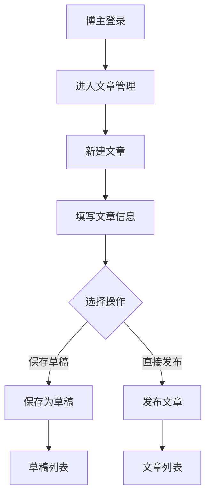
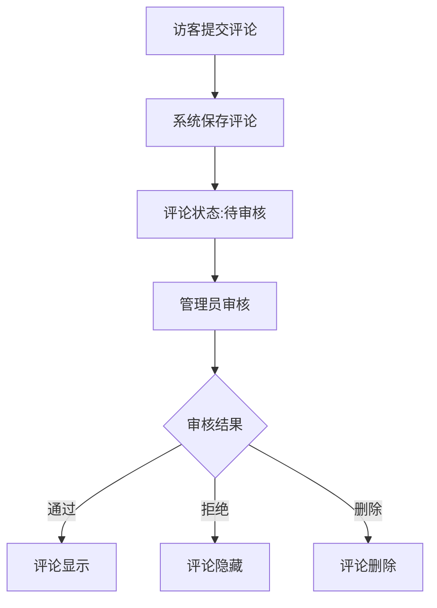

# 博客管理系统 (BMS) 产品需求文档

## 1. 文档信息

| 项目 | 内容 |
|------|------|
| 项目名称 | 博客管理系统 (Blog Management System) |
| 项目简称 | BMS |
| 文档版本 | v1.0.0 |
| 创建日期 | 2026-03-24 |
| 文档作者 | AI Assistant |
| 技术框架 | Snowy v3.6.1 |

### 修订历史

| 版本 | 日期 | 修订内容 | 作者 |
|------|------|----------|------|
| v1.0.0 | 2026-03-24 | 初始版本 | AI Assistant |

---

## 2. 产品概述

### 2.1 产品背景

随着内容创作行业的蓬勃发展，越来越多的个人博主、内容创作者和小型媒体团队需要一个专业、易用的博客管理系统来管理他们的内容。现有的解决方案要么过于复杂，要么功能不够完善，无法满足中小型内容创作者的需求。

博客管理系统(BMS)旨在提供一个轻量级、功能完善、易于扩展的内容管理平台，帮助用户高效管理博客文章、评论、媒体资源等内容。

### 2.2 产品目标

| 目标类型 | 目标描述 |
|----------|----------|
| 核心目标 | 提供完整的博客内容管理解决方案 |
| 用户目标 | 简化内容发布流程，提升创作效率 |
| 技术目标 | 基于Snowy框架快速构建，保证系统稳定性 |
| 商业目标 | 支持SEO优化，提升内容曝光度 |

### 2.3 目标用户

| 用户角色 | 用户描述 | 核心需求 |
|----------|----------|----------|
| 博主 | 个人内容创作者 | 文章发布、管理、统计 |
| 编辑 | 内容审核人员 | 内容审核、编辑、发布 |
| 访客 | 网站访问者 | 阅读文章、发表评论 |
| 管理员 | 系统运维人员 | 系统配置、用户管理 |

### 2.4 使用场景

| 场景编号 | 场景描述 | 触发条件 | 期望结果 |
|----------|----------|----------|----------|
| UC-001 | 博主撰写新文章 | 博主登录后台，点击新建文章 | 文章成功保存并发布 |
| UC-002 | 编辑审核文章 | 作者提交文章后 | 编辑审核通过后文章上线 |
| UC-003 | 访客浏览文章 | 访客访问博客首页 | 显示文章列表，可点击阅读 |
| UC-004 | 访客发表评论 | 访客阅读文章后 | 评论提交成功，等待审核 |
| UC-005 | 管理员配置系统 | 系统需要调整参数 | 配置生效，系统正常运行 |

---

## 3. 功能需求

### 3.1 功能清单

#### 3.1.1 文章管理模块

| 功能编号 | 功能名称 | 功能描述 | 优先级 |
|----------|----------|----------|--------|
| F-ART-001 | 文章发布 | 创建并发布博客文章 | Must Have |
| F-ART-002 | 文章编辑 | 修改已发布的文章内容 | Must Have |
| F-ART-003 | 文章删除 | 删除不需要的文章 | Must Have |
| F-ART-004 | 文章列表 | 查看所有文章列表 | Must Have |
| F-ART-005 | 文章搜索 | 按标题、内容搜索文章 | Should Have |
| F-ART-006 | 文章分类 | 文章分类管理 | Must Have |
| F-ART-007 | 文章标签 | 文章标签管理 | Should Have |
| F-ART-008 | 文章置顶 | 设置文章置顶显示 | Could Have |
| F-ART-009 | 文章推荐 | 设置文章为推荐文章 | Could Have |
| F-ART-010 | 草稿保存 | 保存文章草稿 | Must Have |
| F-ART-011 | 富文本编辑 | 支持富文本编辑器 | Must Have |
| F-ART-012 | Markdown支持 | 支持Markdown格式 | Should Have |
| F-ART-013 | 文章封面 | 设置文章封面图片 | Should Have |
| F-ART-014 | 文章摘要 | 自动或手动生成摘要 | Should Have |
| F-ART-015 | 发布时间设置 | 定时发布文章 | Could Have |

#### 3.1.2 分类标签模块

| 功能编号 | 功能名称 | 功能描述 | 优先级 |
|----------|----------|----------|--------|
| F-CAT-001 | 分类管理 | 创建、编辑、删除分类 | Must Have |
| F-CAT-002 | 分类排序 | 调整分类显示顺序 | Should Have |
| F-CAT-003 | 标签管理 | 创建、编辑、删除标签 | Must Have |
| F-CAT-004 | 标签云 | 显示标签云效果 | Could Have |

#### 3.1.3 评论管理模块

| 功能编号 | 功能名称 | 功能描述 | 优先级 |
|----------|----------|----------|--------|
| F-CMT-001 | 发表评论 | 访客发表评论 | Must Have |
| F-CMT-002 | 评论审核 | 管理员审核评论 | Must Have |
| F-CMT-003 | 评论回复 | 回复用户评论 | Should Have |
| F-CMT-004 | 评论删除 | 删除不当评论 | Must Have |
| F-CMT-005 | 评论列表 | 查看所有评论列表 | Must Have |
| F-CMT-006 | 评论过滤 | 敏感词过滤 | Should Have |

#### 3.1.4 媒体库模块

| 功能编号 | 功能名称 | 功能描述 | 优先级 |
|----------|----------|----------|--------|
| F-MED-001 | 图片上传 | 上传图片资源 | Must Have |
| F-MED-002 | 视频上传 | 上传视频资源 | Should Have |
| F-MED-003 | 附件上传 | 上传附件文件 | Should Have |
| F-MED-004 | 媒体列表 | 查看所有媒体资源 | Must Have |
| F-MED-005 | 媒体删除 | 删除媒体资源 | Must Have |
| F-MED-006 | 图片压缩 | 自动压缩图片 | Could Have |
| F-MED-007 | 水印设置 | 图片水印功能 | Could Have |

#### 3.1.5 SEO优化模块

| 功能编号 | 功能名称 | 功能描述 | 优先级 |
|----------|----------|----------|--------|
| F-SEO-001 | 文章SEO设置 | 设置文章SEO信息 | Should Have |
| F-SEO-002 | 站点SEO配置 | 全站SEO配置 | Should Have |
| F-SEO-003 | 友情链接 | 友情链接管理 | Could Have |
| F-SEO-004 | Sitemap生成 | 自动生成站点地图 | Could Have |

#### 3.1.6 统计分析模块

| 功能编号 | 功能名称 | 功能描述 | 优先级 |
|----------|----------|----------|--------|
| F-STA-001 | 访问统计 | 统计网站访问量 | Should Have |
| F-STA-002 | 文章热度 | 统计文章阅读量 | Must Have |
| F-STA-003 | 评论统计 | 统计评论数量 | Should Have |
| F-STA-004 | 数据报表 | 生成统计报表 | Could Have |

#### 3.1.7 系统管理模块

| 功能编号 | 功能名称 | 功能描述 | 优先级 |
|----------|----------|----------|--------|
| F-SYS-001 | 用户管理 | 用户账号管理 | Must Have |
| F-SYS-002 | 角色管理 | 角色权限管理 | Must Have |
| F-SYS-003 | 菜单管理 | 系统菜单管理 | Must Have |
| F-SYS-004 | 配置管理 | 系统参数配置 | Must Have |
| F-SYS-005 | 操作日志 | 记录操作日志 | Should Have |
| F-SYS-006 | 登录日志 | 记录登录日志 | Should Have |

### 3.2 功能详细说明

#### 3.2.1 文章发布 (F-ART-001)

**用户故事**: 作为博主，我希望能够方便地创建和发布文章，以便分享我的内容给读者。

**业务流程**:
```
1. 博主登录后台
2. 进入文章管理模块
3. 点击"新建文章"
4. 填写文章信息（标题、内容、分类、标签等）
5. 点击"发布"或"保存草稿"
6. 系统保存文章
```

**输入数据**:
| 字段名称 | 字段类型 | 是否必填 | 校验规则 |
|----------|----------|----------|----------|
| 文章标题 | String | 是 | 1-200字符 |
| 文章内容 | Text | 是 | 不少于10字符 |
| 文章分类 | Long | 是 | 必须选择已存在的分类 |
| 文章标签 | List<Long> | 否 | 可选择多个标签 |
| 文章封面 | String | 否 | 图片URL |
| 文章摘要 | String | 否 | 最多500字符 |
| 发布状态 | Enum | 是 | DRAFT/PUBLISHED |

**输出数据**:
| 字段名称 | 字段类型 | 说明 |
|----------|----------|------|
| 文章ID | Long | 文章唯一标识 |
| 创建时间 | DateTime | 文章创建时间 |
| 发布时间 | DateTime | 文章发布时间 |

#### 3.2.2 评论管理 (F-CMT-001)

**用户故事**: 作为访客，我希望能够对文章发表评论，以便与作者和其他读者交流。

**业务流程**:
```
1. 访客阅读文章
2. 填写评论内容
3. 提交评论
4. 系统保存评论（待审核状态）
5. 管理员审核通过
6. 评论显示在文章下方
```

**输入数据**:
| 字段名称 | 字段类型 | 是否必填 | 校验规则 |
|----------|----------|----------|----------|
| 评论内容 | String | 是 | 1-1000字符 |
| 评论者昵称 | String | 是 | 1-50字符 |
| 评论者邮箱 | String | 否 | 邮箱格式 |
| 文章ID | Long | 是 | 必须存在的文章 |

**输出数据**:
| 字段名称 | 字段类型 | 说明 |
|----------|----------|------|
| 评论ID | Long | 评论唯一标识 |
| 评论时间 | DateTime | 评论创建时间 |
| 审核状态 | Enum | PENDING/APPROVED/REJECTED |

### 3.3 业务流程

#### 3.3.1 文章发布流程



#### 3.3.2 评论审核流程



---

## 4. 非功能需求

### 4.1 性能需求

| 指标名称 | 指标要求 | 说明 |
|----------|----------|------|
| 页面响应时间 | < 2秒 | 普通页面加载时间 |
| API响应时间 | < 500ms | 接口响应时间 |
| 并发用户数 | ≥ 100 | 同时在线用户数 |
| 吞吐量 | ≥ 100 QPS | 每秒请求数 |

### 4.2 安全需求

| 安全需求 | 具体要求 |
|----------|----------|
| 身份认证 | 支持用户名密码登录，支持第三方登录 |
| 访问控制 | 基于角色的权限控制(RBAC) |
| 数据加密 | 密码使用国密SM4加密存储 |
| 安全传输 | 支持HTTPS协议 |
| XSS防护 | 输入内容进行XSS过滤 |
| CSRF防护 | 关键操作需要CSRF Token |
| 敏感词过滤 | 评论内容敏感词过滤 |

### 4.3 可靠性需求

| 指标名称 | 指标要求 |
|----------|----------|
| 系统可用性 | ≥ 99.9% |
| 故障恢复时间 | < 30分钟 |
| 数据备份 | 每日自动备份 |
| 日志记录 | 完整的操作日志和错误日志 |

### 4.4 兼容性需求

| 兼容类型 | 兼容要求 |
|----------|----------|
| 浏览器兼容 | Chrome、Firefox、Safari、Edge最新版本 |
| 移动端兼容 | 响应式布局，支持移动端访问 |
| 数据库兼容 | MySQL 8.0+ |

### 4.5 可维护性需求

| 需求名称 | 具体要求 |
|----------|----------|
| 代码规范 | 遵循阿里巴巴Java开发规范 |
| 文档完整 | 提供完整的开发文档和部署文档 |
| 可扩展性 | 支持插件化扩展 |

---

## 5. 接口需求

### 5.1 用户接口

| 接口类型 | 接口描述 |
|----------|----------|
| Web管理后台 | 博主和管理员使用的管理界面 |
| 前台展示页面 | 访客浏览文章的前台界面 |

### 5.2 软件接口

| 接口名称 | 接口类型 | 接口描述 |
|----------|----------|----------|
| 文件存储接口 | RESTful API | 对接OSS/MinIO文件存储服务 |
| 缓存接口 | Redis | 数据缓存接口 |
| 数据库接口 | JDBC | MySQL数据库接口 |

### 5.3 API接口列表

| 接口路径 | 请求方法 | 接口描述 |
|----------|----------|----------|
| /api/article/list | GET | 获取文章列表 |
| /api/article/{id} | GET | 获取文章详情 |
| /api/article | POST | 创建文章 |
| /api/article/{id} | PUT | 更新文章 |
| /api/article/{id} | DELETE | 删除文章 |
| /api/category/list | GET | 获取分类列表 |
| /api/tag/list | GET | 获取标签列表 |
| /api/comment/list | GET | 获取评论列表 |
| /api/comment | POST | 提交评论 |
| /api/media/upload | POST | 上传媒体文件 |

---

## 6. 数据需求

### 6.1 数据实体

#### 6.1.1 文章实体 (BMS_ARTICLE)

| 字段名称 | 字段类型 | 字段描述 |
|----------|----------|----------|
| ID | BIGINT | 主键ID |
| TITLE | VARCHAR(200) | 文章标题 |
| CONTENT | LONGTEXT | 文章内容 |
| SUMMARY | VARCHAR(500) | 文章摘要 |
| COVER_IMAGE | VARCHAR(255) | 封面图片 |
| CATEGORY_ID | BIGINT | 分类ID |
| AUTHOR_ID | BIGINT | 作者ID |
| STATUS | VARCHAR(20) | 状态(DRAFT/PUBLISHED) |
| VIEW_COUNT | INT | 阅读量 |
| COMMENT_COUNT | INT | 评论数 |
| IS_TOP | TINYINT | 是否置顶 |
| IS_RECOMMEND | TINYINT | 是否推荐 |
| PUBLISH_TIME | DATETIME | 发布时间 |
| CREATE_TIME | DATETIME | 创建时间 |
| UPDATE_TIME | DATETIME | 更新时间 |
| DELETE_FLAG | VARCHAR(20) | 删除标志 |

#### 6.1.2 分类实体 (BMS_CATEGORY)

| 字段名称 | 字段类型 | 字段描述 |
|----------|----------|----------|
| ID | BIGINT | 主键ID |
| NAME | VARCHAR(50) | 分类名称 |
| CODE | VARCHAR(50) | 分类编码 |
| PARENT_ID | BIGINT | 父分类ID |
| SORT_CODE | INT | 排序码 |
| DESCRIPTION | VARCHAR(255) | 分类描述 |
| CREATE_TIME | DATETIME | 创建时间 |
| UPDATE_TIME | DATETIME | 更新时间 |
| DELETE_FLAG | VARCHAR(20) | 删除标志 |

#### 6.1.3 标签实体 (BMS_TAG)

| 字段名称 | 字段类型 | 字段描述 |
|----------|----------|----------|
| ID | BIGINT | 主键ID |
| NAME | VARCHAR(50) | 标签名称 |
| CODE | VARCHAR(50) | 标签编码 |
| COLOR | VARCHAR(20) | 标签颜色 |
| SORT_CODE | INT | 排序码 |
| CREATE_TIME | DATETIME | 创建时间 |
| UPDATE_TIME | DATETIME | 更新时间 |
| DELETE_FLAG | VARCHAR(20) | 删除标志 |

#### 6.1.4 评论实体 (BMS_COMMENT)

| 字段名称 | 字段类型 | 字段描述 |
|----------|----------|----------|
| ID | BIGINT | 主键ID |
| ARTICLE_ID | BIGINT | 文章ID |
| PARENT_ID | BIGINT | 父评论ID |
| NICKNAME | VARCHAR(50) | 评论者昵称 |
| EMAIL | VARCHAR(100) | 评论者邮箱 |
| CONTENT | VARCHAR(1000) | 评论内容 |
| STATUS | VARCHAR(20) | 状态(PENDING/APPROVED/REJECTED) |
| IP_ADDRESS | VARCHAR(50) | IP地址 |
| CREATE_TIME | DATETIME | 创建时间 |
| DELETE_FLAG | VARCHAR(20) | 删除标志 |

#### 6.1.5 媒体实体 (BMS_MEDIA)

| 字段名称 | 字段类型 | 字段描述 |
|----------|----------|----------|
| ID | BIGINT | 主键ID |
| FILE_NAME | VARCHAR(255) | 文件名称 |
| FILE_PATH | VARCHAR(500) | 文件路径 |
| FILE_SIZE | BIGINT | 文件大小 |
| FILE_TYPE | VARCHAR(50) | 文件类型 |
| MIME_TYPE | VARCHAR(100) | MIME类型 |
| UPLOAD_USER | BIGINT | 上传用户 |
| CREATE_TIME | DATETIME | 创建时间 |
| DELETE_FLAG | VARCHAR(20) | 删除标志 |

### 6.2 数据关系

```
BMS_CATEGORY (1) ----< (N) BMS_ARTICLE
BMS_TAG (N) >----< (N) BMS_ARTICLE (通过关联表)
BMS_ARTICLE (1) ----< (N) BMS_COMMENT
SYS_USER (1) ----< (N) BMS_ARTICLE
```

---

## 7. 约束条件

### 7.1 技术约束

| 约束类型 | 约束要求 |
|----------|----------|
| 开发框架 | Snowy v3.6.1 (Spring Boot 3.5.9 + Vue 3.5.10) |
| JDK版本 | JDK 17 |
| 数据库 | MySQL 8.0+ |
| 缓存 | Redis 6.0+ |
| 权限框架 | Sa-Token 1.44.0 |
| 前端框架 | Vue 3 + Ant Design Vue 4 |
| ORM框架 | MyBatis-Plus 3.5.5 |

### 7.2 业务约束

| 约束类型 | 约束要求 |
|----------|----------|
| 文章标题长度 | 最大200字符 |
| 文章内容长度 | 无限制 |
| 评论内容长度 | 最大1000字符 |
| 文件上传大小 | 最大100MB |
| 分类层级 | 支持多级分类 |

### 7.3 法规约束

| 约束类型 | 约束要求 |
|----------|----------|
| 内容审核 | 评论内容需审核后发布 |
| 数据安全 | 敏感数据加密存储 |
| 日志记录 | 操作日志保留至少6个月 |

---

## 8. 附录

### 8.1 术语表

| 术语 | 定义 |
|------|------|
| BMS | Blog Management System，博客管理系统 |
| PRD | Product Requirements Document，产品需求文档 |
| SEO | Search Engine Optimization，搜索引擎优化 |
| RBAC | Role-Based Access Control，基于角色的访问控制 |
| QPS | Queries Per Second，每秒查询数 |

### 8.2 参考文档

| 文档名称 | 文档来源 |
|----------|----------|
| Snowy官方文档 | https://www.xiaonuobase.com |
| Spring Boot文档 | https://spring.io/projects/spring-boot |
| Vue.js文档 | https://vuejs.org |
| Ant Design Vue文档 | https://antdv.com |

---

**文档结束**